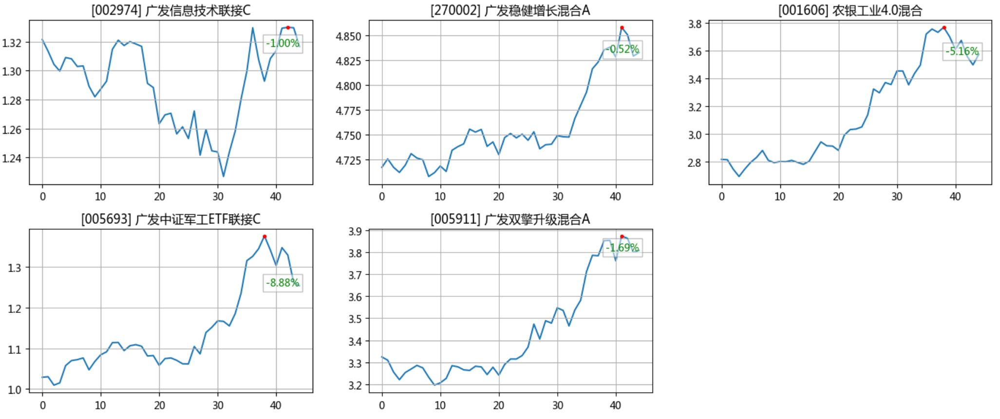

# Eastmoney1234567

Make money, quickly quickly. Utilization of 1234567 fund APIs.

## Usage

 - Input fund code into a XLSX file and make a list with name and benefit rate in recent years (optional):

 `make_sheet <fund_list.xlsx> <ifGetRate, 0 or 1>`

 - Launch the monitor:

 `monitor <fund_list.xlsx> <delay> [threadNum]`

 

 - Show a curve wall:

 `python3 k-wall.py <fund_list.xlsx> [backtracking_days]`

 

## For those who want to build a executable

> https://github.com/pyinstaller/pyinstaller/issues/5319

 - If the exeutable made by pyInstaller shows the error "prettytable distribution was not found", copy hook-prettytable.py to the hook directory.

 - For Windows, the path maybe

 `...\Python36\Lib\site-packages\PyInstaller\hooks`